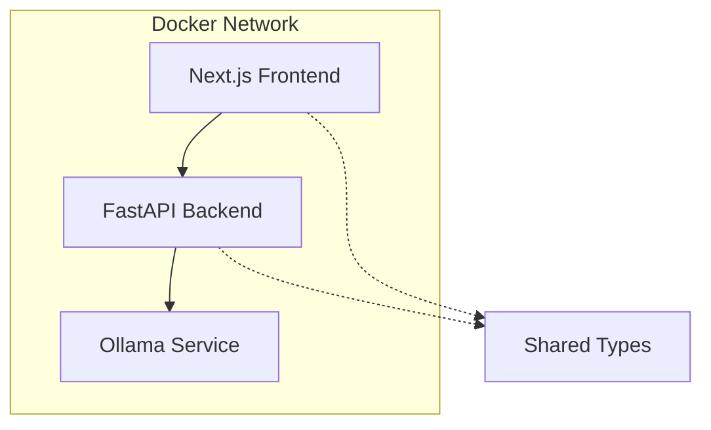

# CON-LLM-Container: Production-Ready LLM Application Template

A clean, extensible template for LLM applications with FastAPI, Ollama, and Docker. Built following YAGNI principles and SOLID design patterns for production use.

## 🏗️ Project Structure

```
con-llm-container-base/
├── backend/                     # FastAPI backend service
│   ├── app/
│   │   ├── main.py             # FastAPI application entry point
│   │   ├── config.py           # Configuration management
│   │   ├── models.py           # Pydantic models (API contracts)
│   │   ├── ollama_client.py    # Ollama integration client
│   │   └── database/           # Database integration (prepared)
│   ├── Dockerfile              # Backend container definition
│   └── pyproject.toml          # Python dependencies and metadata
├── frontend/                    # Frontend preparation directory
│   └── README.md               # Frontend integration guide
├── shared/                      # Shared type definitions
│   ├── types.py                # Python types (backend)
│   └── types.ts                # TypeScript types (frontend)
├── docker-compose.yml           # Main orchestration file
├── backend.yml                  # Backend-specific services
├── frontend.yml                 # Frontend-specific services
├── .env.example                 # Environment configuration template
└── README.md                    # This file
```

## 🚀 Quick Start

### 1. Environment Setup

```bash
# Copy environment template and customize
cp .env.example .env
# Edit .env with your preferred settings (see Environment Variables section)
```

### 2. Launch Services

```bash
# Start all services (backend + frontend)
docker compose up

# Or run in background
docker compose up -d
```

### 3. Verify Installation

```bash
# Check health status
curl http://localhost:8080/health

# Test simple question
curl -X POST http://localhost:8080/ask \
  -H "Content-Type: application/json" \
  -d '{"question": "Hello, how are you?"}'
```

## 🔄 CI/CD Pipeline

This project includes a comprehensive GitHub Actions CI/CD pipeline that automatically validates code quality, runs tests, and ensures Docker builds work correctly on every push and pull request.

### Pipeline Overview

The CI pipeline runs **5 parallel jobs** for fast validation:

| Job | Purpose | Key Actions |
|-----|---------|-------------|
| **Lint & Format** | Code quality checks | Black formatting, Ruff linting (Python + TypeScript) |
| **Test** | Automated testing | Pytest execution, auto-generated tests if missing |
| **Docker Build** | Container validation | Build backend image, test container startup |
| **Docker Compose** | Orchestration validation | Validate all compose configurations |
| **Security Scan** | Security checks | Dependency vulnerabilities, secret detection |

### Workflow Features

#### ✅ **Code Quality Enforcement**
- **Black Formatting**: Ensures consistent Python code formatting with `--check --diff`
- **Ruff Linting**: Comprehensive Python linting using project's `pyproject.toml` rules
- **TypeScript Linting**: ESLint validation for shared TypeScript types with auto-generated config

#### 🧪 **Automated Testing**
- **Pytest Integration**: Runs all tests with asyncio support
- **Smart Test Creation**: Auto-generates basic FastAPI tests if none exist (health, root, docs endpoints)
- **Legacy Test Support**: Executes existing test files (`test_enhancements.py`, `verify_enhancements.py`)

#### 🐳 **Docker Validation**
- **Image Building**: Tests backend Docker image builds successfully
- **Container Health**: Validates container startup and basic functionality
- **Compose Validation**: Ensures all docker-compose configurations are valid

#### 🔒 **Security & Dependencies**
- **Vulnerability Scanning**: Python dependency security checks with Safety
- **Secret Detection**: TruffleHog scans for accidentally committed credentials
- **Dependency Health**: Validates all project dependencies

### Triggering the Pipeline

The CI pipeline automatically runs on:

```yaml
# Triggers
on:
  push:
    branches: [ main, develop ]
  pull_request:
    branches: [ main, develop ]
```

### Local Development Workflow

Before pushing code, you can run the same checks locally:

#### Code Quality Checks
```bash
cd backend

# Install development dependencies
uv venv
uv pip install -e ".[dev]"

# Run formatting check
uv run black --check --diff .

# Run linting
uv run ruff check .

# Fix formatting issues
uv run black .

# Fix linting issues
uv run ruff check --fix .
```

#### Run Tests Locally
```bash
cd backend

# Run all tests
uv run pytest -v

# Run tests with coverage
uv run pytest --cov=app --cov-report=html

# Run specific test file
uv run pytest tests/test_specific.py -v
```

#### Docker Build Testing
```bash
# Test backend Docker build
cd backend
docker build -t con-llm-test .

# Test full docker-compose setup
cp .env.example .env
docker-compose build --no-cache
docker-compose config  # Validate configuration
```

### Pipeline Status & Badges

Add these badges to your repository to show CI status:

```markdown


```

### Troubleshooting CI Issues

#### Common CI Failures

**Formatting Issues**
```bash
# Fix locally before pushing
cd backend
uv run black .
git add . && git commit -m "Fix formatting"
```

**Linting Errors**
```bash
# View and fix linting issues
cd backend
uv run ruff check .
uv run ruff check --fix .  # Auto-fix where possible
```

**Test Failures**
```bash
# Run tests locally to debug
cd backend
uv run pytest -v --tb=long
```

**Docker Build Failures**
```bash
# Test Docker build locally
cd backend
docker build --no-cache -t test-image .
```

#### CI Environment Details

The CI pipeline uses:
- **Python**: 3.12 (matches project requirements)
- **Node.js**: 18 (for TypeScript tooling)
- **Package Manager**: `uv` for fast Python dependency management
- **Docker**: Latest with Buildx for advanced build features

### Contributing Guidelines

When contributing to this project:

1. **Fork & Branch**: Create feature branches from `develop`
2. **Local Testing**: Run formatting, linting, and tests locally first
3. **Commit Quality**: Use conventional commit messages
4. **Pull Request**: Target `develop` branch, CI must pass
5. **Code Review**: Address feedback and ensure CI remains green

The CI pipeline ensures every contribution maintains code quality, security, and functionality standards automatically! 🚀

## 📋 Usage Examples

### CLI Usage

#### Direct Docker Commands

```bash
# Ask a simple question
docker compose run --rm backend python -c "
import asyncio
from app.ollama_client import OllamaClient
client = OllamaClient()
result = asyncio.run(client.generate('What is Docker?'))
print(result['response'])
"

# Run interactive shell
docker compose run --rm backend bash

# Check available models
docker compose exec backend python -c "
import asyncio
from app.ollama_client import OllamaClient
client = OllamaClient()
models = asyncio.run(client.list_models())
print([m['name'] for m in models['models']])
"
```

#### Development Mode

```bash
# Start development environment with shell access
docker compose --profile dev up

# Access development container
docker compose exec backend-dev bash

# Run example scripts
docker compose exec backend python scripts/example_direct.py
docker compose exec backend python scripts/example_api.py
```

### API Usage Examples

#### Health Check

```bash
# Basic health check
curl http://localhost:8080/health

# Response:
# {
#   "status": "healthy",
#   "ollama_connected": true,
#   "timestamp": "2024-01-15T10:30:00Z",
#   "version": "1.0.0"
# }
```

#### Simple Question (Ask Endpoint)

```bash
# Ask a conversational question
curl -X POST http://localhost:8080/ask \
  -H "Content-Type: application/json" \
  -d '{
    "question": "Explain Docker containers in simple terms",
    "model": "llama3.2:1b",
    "temperature": 0.7
  }'

# Response:
# {
#   "answer": "Docker containers are lightweight, portable packages that include everything needed to run an application...",
#   "model": "llama3.2:1b",
#   "context_used": false
# }
```

#### Advanced Text Generation

```bash
# Generate text with full options
curl -X POST http://localhost:8080/generate \
  -H "Content-Type: application/json" \
  -d '{
    "prompt": "Write a Python function to calculate fibonacci numbers",
    "model": "llama3.2:1b",
    "temperature": 0.5,
    "stream": false
  }'

# Response:
# {
#   "response": "def fibonacci(n):\n    if n <= 1:\n        return n\n    return fibonacci(n-1) + fibonacci(n-2)",
#   "model": "llama3.2:1b",
#   "done": true,
#   "total_duration": 1234567890
# }
```

#### List Available Models

```bash
# Get all available models
curl http://localhost:8080/models

# Response:
# {
#   "models": [
#     {
#       "name": "llama3.2:1b",
#       "size": 1235000000,
#       "digest": "sha256:abc123...",
#       "details": {
#         "format": "gguf",
#         "family": "llama",
#         "parameter_size": "1B"
#       }
#     }
#   ]
# }
```

#### Streaming Responses

```bash
# Enable streaming for real-time responses
curl -X POST http://localhost:8080/generate \
  -H "Content-Type: application/json" \
  -d '{
    "prompt": "Write a short story about AI",
    "stream": true
  }' \
  --no-buffer

# Streams Server-Sent Events (SSE) format
```

## 📡 API Reference

### Endpoints

| Method | Endpoint | Description | Auth Required |
|--------|----------|-------------|---------------|
| `GET` | `/` | API information and status | No |
| `GET` | `/health` | Comprehensive health check | No |
| `GET` | `/health/live` | Kubernetes liveness probe | No |
| `GET` | `/health/ready` | Kubernetes readiness probe | No |
| `GET` | `/models` | List available Ollama models | No |
| `POST` | `/ask` | Simple conversational interface | No |
| `POST` | `/generate` | Advanced text generation | No |
| `GET` | `/metrics` | Prometheus metrics | No |

### Request/Response Schemas

#### POST /ask

**Request Schema:**
```json
{
  "question": "string (required)",     // Question to ask the AI
  "model": "string (optional)",        // Model name (uses default if not specified)
  "temperature": "float (optional)"    // 0.0-2.0, creativity level (default: 0.7)
}
```

**Response Schema:**
```json
{
  "answer": "string",           // AI's response to the question
  "model": "string",            // Model used for generation
  "context_used": "boolean"     // Whether conversation context was used
}
```

**Example:**
```bash
curl -X POST http://localhost:8080/ask \
  -H "Content-Type: application/json" \
  -d '{
    "question": "What are the benefits of microservices?",
    "model": "llama3.2:1b",
    "temperature": 0.5
  }'
```

#### POST /generate

**Request Schema:**
```json
{
  "prompt": "string (required)",       // Input prompt for text generation
  "model": "string (optional)",        // Model name (uses default if not specified)
  "temperature": "float (optional)",   // 0.0-2.0, sampling temperature (default: 0.7)
  "stream": "boolean (optional)"       // Enable streaming response (default: false)
}
```

**Response Schema:**
```json
{
  "response": "string",         // Generated text content
  "model": "string",            // Model used for generation
  "done": "boolean",            // Whether generation is complete
  "total_duration": "integer"   // Generation time in nanoseconds (optional)
}
```

**Example:**
```bash
curl -X POST http://localhost:8080/generate \
  -H "Content-Type: application/json" \
  -d '{
    "prompt": "Create a REST API endpoint in FastAPI",
    "temperature": 0.3,
    "stream": false
  }'
```

#### GET /models

**Response Schema:**
```json
{
  "models": [
    {
      "name": "string",                    // Model identifier
      "size": "integer",                   // Model size in bytes
      "digest": "string",                  // Model hash for verification
      "details": {                         // Additional model information
        "format": "string",                // Model format (e.g., "gguf")
        "family": "string",                // Model family (e.g., "llama")
        "parameter_size": "string"         // Parameter count (e.g., "7B")
      }
    }
  ]
}
```

#### GET /health

**Response Schema:**
```json
{
  "status": "string",           // "healthy" or "unhealthy"
  "ollama_connected": "boolean", // Ollama service connection status
  "timestamp": "string",        // ISO 8601 timestamp
  "version": "string"           // API version
}
```

#### Error Responses

All endpoints return consistent error responses:

**Error Schema:**
```json
{
  "error": "string",            // Error type/category
  "message": "string",          // Human-readable error message
  "detail": "string",           // Additional error details (optional)
  "timestamp": "string"         // ISO 8601 timestamp (optional)
}
```

**Common HTTP Status Codes:**
- `200` - Success
- `400` - Bad Request (invalid input)
- `404` - Not Found (model not available)
- `422` - Validation Error (invalid request format)
- `500` - Internal Server Error
- `503` - Service Unavailable (Ollama not connected)

## ⚙️ Environment Variables

### Required Variables

Copy `.env.example` to `.env` and customize these values:

#### Backend Configuration

| Variable | Type | Default | Description |
|----------|------|---------|-------------|
| `DEFAULT_MODEL` | string | `llama3.2:1b` | Default Ollama model to use for generation |
| `OLLAMA_HOST` | string | `0.0.0.0` | Ollama service host (container networking) |
| `OLLAMA_PORT` | integer | `11434` | Ollama service port |
| `API_PORT` | integer | `8000` | Internal FastAPI port (inside container) |
| `API_TIMEOUT` | integer | `300` | Request timeout in seconds |
| `LOG_LEVEL` | string | `INFO` | Logging level (DEBUG, INFO, WARNING, ERROR, CRITICAL) |

#### Port Mappings

| Variable | Type | Default | Description |
|----------|------|---------|-------------|
| `MAIN_API_PORT` | integer | `8080` | External port for main backend service |
| `MAIN_OLLAMA_PORT` | integer | `11434` | External port for main Ollama service |
| `DEV_API_PORT` | integer | `8081` | External port for development backend |
| `DEV_OLLAMA_PORT` | integer | `11435` | External port for development Ollama |
| `OLLAMA_ONLY_PORT` | integer | `11436` | External port for Ollama-only service |

#### Volume Configuration

| Variable | Type | Default | Description |
|----------|------|---------|-------------|
| `OLLAMA_MODELS_PATH` | string | `./models` | Host path for model storage (large files) |
| `LOGS_PATH` | string | `./logs` | Host path for application logs |
| `DATA_PATH` | string | `./data` | Host path for user data and artifacts |

#### Logging Configuration

| Variable | Type | Default | Description |
|----------|------|---------|-------------|
| `LOG_ROTATION` | string | `daily` | Log rotation frequency (daily, weekly, size-based) |
| `LOG_MAX_SIZE` | string | `100MB` | Maximum log file size before rotation |
| `LOG_RETENTION_DAYS` | integer | `30` | Log retention period in days |

#### Frontend Configuration (Optional)

| Variable | Type | Default | Description |
|----------|------|---------|-------------|
| `FRONTEND_PORT` | integer | `3000` | Production frontend port |
| `FRONTEND_DEV_PORT` | integer | `3001` | Development frontend port |
| `BACKEND_URL` | string | `http://backend:8000` | Backend API URL for frontend |
| `NODE_ENV` | string | `production` | Next.js environment mode |
| `NEXT_TELEMETRY_DISABLED` | integer | `1` | Disable Next.js telemetry |

### Environment Setup Examples

#### Development Environment
```bash
# .env for development
DEFAULT_MODEL=llama3.2:1b
LOG_LEVEL=DEBUG
MAIN_API_PORT=8080
OLLAMA_MODELS_PATH=./models
LOGS_PATH=./logs
DATA_PATH=./data
```

#### Production Environment
```bash
# .env for production
DEFAULT_MODEL=llama3.1:8b
LOG_LEVEL=INFO
API_TIMEOUT=600
MAIN_API_PORT=80
OLLAMA_MODELS_PATH=/var/lib/ollama/models
LOGS_PATH=/var/log/con-llm
DATA_PATH=/var/lib/con-llm/data
LOG_RETENTION_DAYS=90
```

## 🔧 Development Modes

### Full Development Environment

```bash
# Start with development profile (hot reload, shell access)
docker compose --profile dev up

# Access services:
# - Backend Dev: http://localhost:8081 (shell access)
# - Frontend Dev: http://localhost:3001 (hot reload)
```

### Backend Only

```bash
# Start only backend services
docker compose -f backend.yml up

# Or just Ollama without FastAPI
docker compose --profile ollama up ollama-only
```

### Service Profiles

| Profile | Services | Use Case |
|---------|----------|----------|
| `default` | backend, frontend, ollama | Production deployment |
| `dev` | backend-dev, frontend-dev, ollama | Development with hot reload |
| `ollama` | ollama-only | Ollama service only |

## 📦 Docker Volume Persistence

### Volume Mappings

| Purpose | Host Path | Container Path | Description |
|---------|-----------|----------------|-------------|
| **Model Storage** | `./models` | `/home/llmuser/.ollama/models` | LLM model files (large downloads) |
| **Application Logs** | `./logs` | `/app/logs` | Runtime logs and debugging |
| **Data & Artifacts** | `./data` | `/app/data` | Prompt histories, temp files |

### Initial Setup

```bash
# Create required directories
mkdir -p ./models ./logs ./data

# Set proper permissions
chmod 755 ./models ./logs ./data

# Start services
docker compose up
```

### Data Organization

```bash
./data/
├── prompts/          # Conversation histories
├── temp/             # Temporary processing files
├── uploads/          # User uploaded files
└── exports/          # Generated exports and reports
```

## 🏗️ Architecture

### Service Communication



### Key Features

- **Clean Architecture**: Separation of concerns with shared types
- **Production Ready**: Health checks, logging, metrics
- **Development Tools**: Hot reload, shell access, example scripts
- **Flexible Deployment**: Multiple compose profiles
- **Type Safety**: Shared TypeScript/Python types

## 🔒 Security Best Practices

1. **Environment Variables**: Never commit `.env` files to version control
2. **Network Security**: Restrict external port access in production
3. **File Permissions**: Secure model and data directory permissions
4. **Container Security**: Non-root user execution
5. **API Security**: Add authentication for production deployments

## 📊 Monitoring & Observability

### Health Checks

- **Liveness**: `GET /health/live` - Basic service availability
- **Readiness**: `GET /health/ready` - Dependency health checks
- **Comprehensive**: `GET /health` - Detailed status information

### Metrics

- **Prometheus**: `GET /metrics` - Prometheus-compatible metrics
- **Request Tracking**: HTTP request/response logging
- **Performance**: Response times and generation metrics

### Logging

- **Structured Logging**: JSON format with Loguru
- **Log Levels**: Configurable verbosity
- **Log Rotation**: Automatic cleanup and archival

## 🚀 Production Deployment

### Docker Compose Production

```bash
# Production deployment
cp .env.example .env
# Configure production values in .env
docker compose up -d

# Verify deployment
curl http://localhost:8080/health
```

### Kubernetes Deployment

```yaml
# Example Kubernetes deployment
apiVersion: apps/v1
kind: Deployment
metadata:
  name: con-llm-backend
spec:
  replicas: 3
  selector:
    matchLabels:
      app: con-llm-backend
  template:
    metadata:
      labels:
        app: con-llm-backend
    spec:
      containers:
      - name: backend
        image: con-llm-backend:latest
        ports:
        - containerPort: 8000
        livenessProbe:
          httpGet:
            path: /health/live
            port: 8000
        readinessProbe:
          httpGet:
            path: /health/ready
            port: 8000
```

### Scaling Considerations

- **Model Storage**: Use shared volumes for multiple instances
- **Load Balancing**: Add reverse proxy (nginx, traefik)
- **Resource Limits**: Configure memory/CPU limits
- **Monitoring**: Prometheus + Grafana for observability

## 🆘 Troubleshooting

### Common Issues

**Port Conflicts**
```bash
# Check port usage
netstat -tlnp | grep :8080
# Change ports in .env file
```

**Model Download Issues**
```bash
# Check Ollama connection
docker compose exec backend curl http://ollama:11434/api/version
# Manually pull model
docker compose exec backend ollama pull llama3.2:1b
```

**Permission Issues**
```bash
# Fix directory permissions
sudo chown -R $(id -u):$(id -g) ./models ./logs ./data
# Check container user
docker compose exec backend id
```

**Memory Issues**
```bash
# Check available memory
free -h
# Monitor container usage
docker stats
```

### Debugging Commands

```bash
# View service logs
docker compose logs backend
docker compose logs ollama

# Access container shell
docker compose exec backend bash

# Test API endpoints
curl -v http://localhost:8080/health

# Check environment variables
docker compose exec backend env | grep -E "(OLLAMA|API|LOG)"
```

## 🤝 Contributing

1. Fork the repository
2. Create a feature branch: `git checkout -b feature/amazing-feature`
3. Make changes in appropriate directory (`backend/`, `frontend/`, `shared/`)
4. Test with: `docker compose --profile dev up`
5. Submit a pull request

## 📝 License

This project is licensed under the MIT License - see the LICENSE file for details.

---

**Built with ❤️ for the LLM development community**
